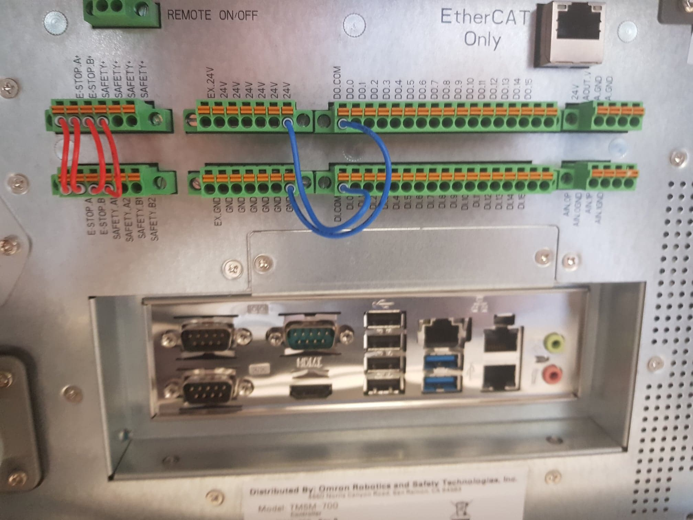
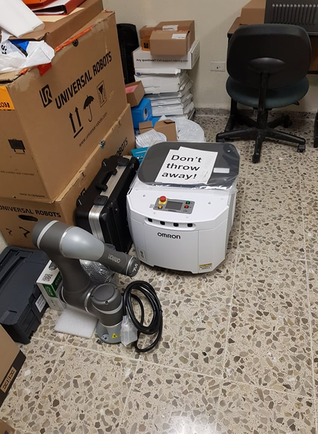
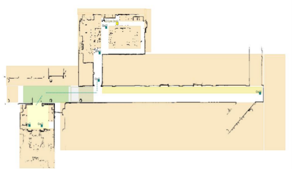
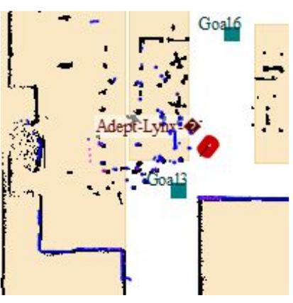

# Mobile Collaborative Robot
## Using OMRON AIV and TM5-700

  

## Project Description
This project is part of the **Industry 4.0 Laboratory** at Tecnológico de Monterrey, which started in 2019. The **Mobile Collaborative Robot** needs to translate 3D materials by grasping them using the **TM5-700** from the manufacturing station and move them using the **OMRON AIV** to the assembly station **without human supervision**.

## Setting up the robot
The set up of the robots was implemented from scratch as they were new. The assembly of the mechanical and electrical components for the correct functionality of the robot was succesfully accomplish by reading the manuals. The most complex component was the **Control Box** as shown in the image bellow:

  

**Important:** For a more detailed explanation of the components, please refer to . 

The **OMRON AIV** and **TM5-700** had to be combined to complete the task. The solution involved the construction of a platform made of aluminum, capable to fix the **TM5-700 base** to the **OMRON AIV**. The robots were separated as shown in the following image:

  

## Installation:
The **OMROM AIV** and **TM5-700** have their respective software to be programmed:

- **TM-Flow-Client:** It Provides the tools to control the **TM5-700**, such as the joints values, camera vision system, peripherals, gripper grasping, and more. The software provides a GUI to enable the programming of the robotic arm.

- **Mobile-Planner:** It enables the tools to manipulate the **OMRON AIV**. The most useful options available are mapping, path planning, localization, sensor fusion, and more. Additionally, it provides an interface to modify the peripherals via software.

**Important:** For a more detailed explanation of both softwares, please refer to the . 

## Project Outcome
The robot was able to generate highly accurate 2D maps of the environment, as shown in the following image:

  

In addition, it was possible to set goals in the map and create different paths by stacking the goals in any order. The robot can be tracked at any time as shown in the image below:

  

**Important:** : Check the videos to watch the movement of the collaborative robot in action ([Project Path Planning Part 1](https://youtu.be/hrFGWuzZCXA) , [Project Path Planning Part 2](https://youtu.be/9PuCbfTGGHI) ).

Also it was able to drive to the dock station by itself.

**Important:** : Check the full video of the [docking station](https://youtu.be/GPSo1DYFkH0)

## Future Improvements
- Setup the gripper to enable the grasp of the objects.
